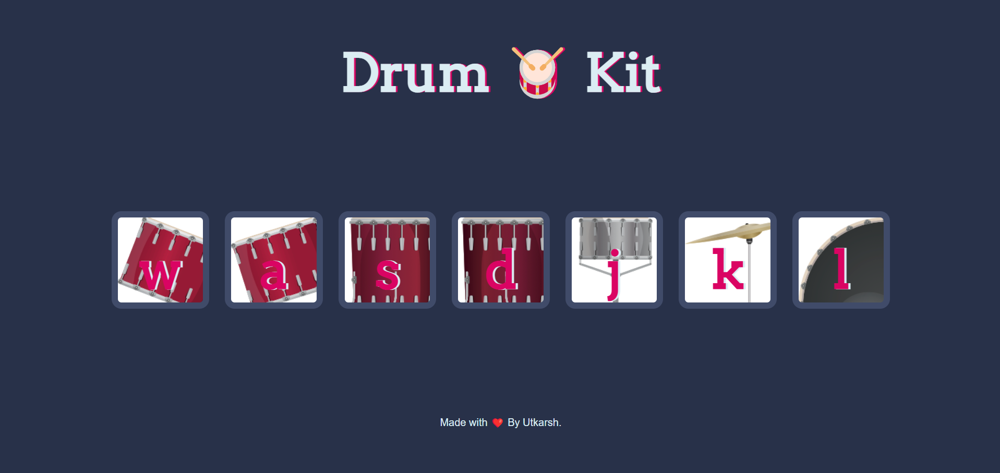

# Drum Kit Website

Welcome to the Drum Kit website repository! This is a simple web-based drum kit that allows users to play different drum sounds by pressing corresponding keys on their keyboard or clicking on the drum buttons on the webpage.

## Preview

Here's a preview of the Drum Kit website:



## How to Play
### Using Mouse
* Open index.html in a web browser.
* Click on the drum buttons displayed on the webpage to play different drum sounds.

### Using Keyboard
Alternatively, you can use your keyboard keys to play drum sounds:
* w: Tom 1
* a: Tom 2
* s: Tom 3
* d: Tom 4
* j: Snare
* k: Crash
* l: Kick

## Broadcast Link

Visit my website here: https://utkarsh1244p.github.io/Drum-Kit/

## Installation

To run the Drum Kit Website locally, follow these steps:

1. **Clone the repository:**

   ```bash
   git clone https://github.com/Utkarsh1244p/Drum-Kit.git

2. **Navigate into the project directory:**

   ```bash
   cd drum-kit

3. **Open the index.html file in your web browser.**

## Folder Structure
The repository has the following structure:
```bash
drum-kit/
├── index.html
├── styles/
│   └── styles.css
├── scripts/
│   └── index.js
├── images/
│   └── drum1.png
│   └── drum2.png
│   └── drum3.png
│   └── drum4.png
│   └── drum5.png
│   └── drum6.png
└── sounds/
    └── tom1.mp3    # Corresponds to 'w' key (Tom 1)
    └── tom2.mp3    # Corresponds to 'a' key (Tom 2)
    └── tom3.mp3    # Corresponds to 's' key (Tom 3)
    └── tom4.mp3    # Corresponds to 'd' key (Tom 4)
    └── snare.mp3   # Corresponds to 'j' key (Snare)
    └── crash.mp3   # Corresponds to 'k' key (Crash)
    └── kick-bass.mp3    # Corresponds to 'l' key (Kick)


